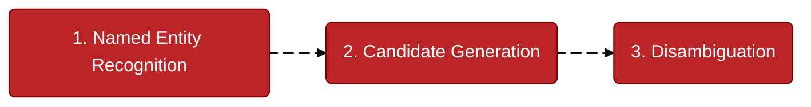

## Introduction

Named Entity Linking, also known as Named Entity Disambiguation, is an advanced Natural Language Processing (NLP) technique that extends beyond simply identifying entities in text. Its primary goal is to **connect a named entity to a unique, real-world identity** in a knowledge base. This is crucial for resolving ambiguity when a name, like "Paris," could refer to multiple different things.

The process is divided into three main steps:



<hr>

- **Named Entity Recognition (NER)**: First, the system identifies and extracts named entities from the text, such as people, organizations, or locations.
- **Candidate Generation**: Next, it searches a knowledge base (like Wikipedia) for all potential matches for the identified entity. For example, "Paris" could be the city, the celebrity Paris Hilton, or a city in Texas.
- **Disambiguation**: Finally, using the surrounding context of the text, the system chooses the correct match from the list of candidates. This step ensures that "Paris" is correctly linked to "Paris, France" when the text also mentions "France."
    

This process allows machines to understand the specific meaning of an entity, enabling more accurate data analysis, information retrieval, and question-answering systems.


---

## Pyton implementation 

Here's a Python example that demonstrates the three main steps of Named Entity Linking: Named Entity Recognition (NER), Candidate Generation, and Disambiguation. This example uses a mock knowledge base and common NLP libraries to illustrate the process.

We'll use the `spacy` library for Named Entity Recognition and a simple dictionary as our mock knowledge base.


### Step 1: Named Entity Recognition (NER)

First, you need to identify the named entities in the text. We'll use a pre-trained `spaCy` model for this.

```python
import spacy

# Load the small English model
nlp = spacy.load("en_core_web_sm")

text = "Paris is a city in France and the home of the Louvre Museum."

# Process the text with spaCy
doc = nlp(text)

# Extract named entities
entities = [(ent.text, ent.label_) for ent in doc.ents]
print(f"Named Entities: {entities}")

# Output will be something like:
# Named Entities: [('Paris', 'GPE'), ('France', 'GPE'), ('the Louvre Museum', 'ORG')]
# Note: 'GPE' stands for Geopolitical Entity, and 'ORG' is an Organization.
```

In this step, `spaCy` correctly identifies **Paris**, **France**, and **the Louvre Museum** as entities.

---

### Step 2: Candidate Generation

Next, for each entity, you need to find potential matches from a knowledge base. We'll create a simple dictionary as our knowledge base to keep this example easy to follow.

```python
# A simple mock knowledge base (KB)
knowledge_base = {
    "Paris": [
        {"name": "Paris, France", "type": "city", "description": "Capital and most populous city of France."},
        {"name": "Paris Hilton", "type": "person", "description": "American socialite, media personality, businesswoman, and model."},
        {"name": "Paris, Texas", "type": "city", "description": "A city in and the county seat of Lamar County, Texas, United States."}
    ],
    "Louvre Museum": [
        {"name": "Louvre Museum", "type": "museum", "description": "The world's largest art museum and a historic monument in Paris, France."}
    ],
    "France": [
        {"name": "France", "type": "country", "description": "A country in Western Europe."}
    ]
}

# Function to generate candidates from the knowledge base
def get_candidates(entity_text):
    return knowledge_base.get(entity_text, [])

# Get candidates for "Paris"
paris_candidates = get_candidates("Paris")
print("\nCandidates for 'Paris':")
for candidate in paris_candidates:
    print(f"- {candidate['name']}: {candidate['description']}")

# Output:
# Candidates for 'Paris':
# - Paris, France: Capital and most populous city of France.
# - Paris Hilton: American socialite...
# - Paris, Texas: A city in and the county seat of Lamar County, Texas...
```

This step gives us a list of all possible "Paris" entities.

---

### Step 3: Disambiguation

Finally, we'll use the context from the original sentence to choose the correct entity. A simple way to do this is to check for related keywords. In a real-world scenario, you would use more advanced techniques like **vector similarity** or **machine learning models**.

```python
# Function to perform simple disambiguation based on context
def disambiguate(entity_text, candidates, context_text):
    best_match = None
    best_score = -1
    
    # Simple scoring: count how many related words appear in the context
    for candidate in candidates:
        score = 0
        candidate_description = candidate['description'].lower()
        
        # Check if context keywords are in the candidate's description
        if "france" in context_text.lower() and "france" in candidate_description:
            score += 1
        if "city" in context_text.lower() and "city" in candidate_description:
            score += 1
            
        if score > best_score:
            best_score = score
            best_match = candidate
            
    return best_match

# The context is the full sentence
context = "Paris is a city in France and the home of the Louvre Museum."

# Disambiguate "Paris"
correct_entity = disambiguate("Paris", get_candidates("Paris"), context)

print(f"\nDisambiguation Result for 'Paris':")
print(f"Correct Entity: {correct_entity['name']} (Type: {correct_entity['type']})")
print(f"Description: {correct_entity['description']}")

# Final Output:
# Disambiguation Result for 'Paris':
# Correct Entity: Paris, France (Type: city)
# Description: Capital and most populous city of France.
```

By checking the context for words like "France" and "city," our simple disambiguation function successfully links "Paris" to the correct entity in our knowledge base. This is the core logic behind Named Entity Linking.