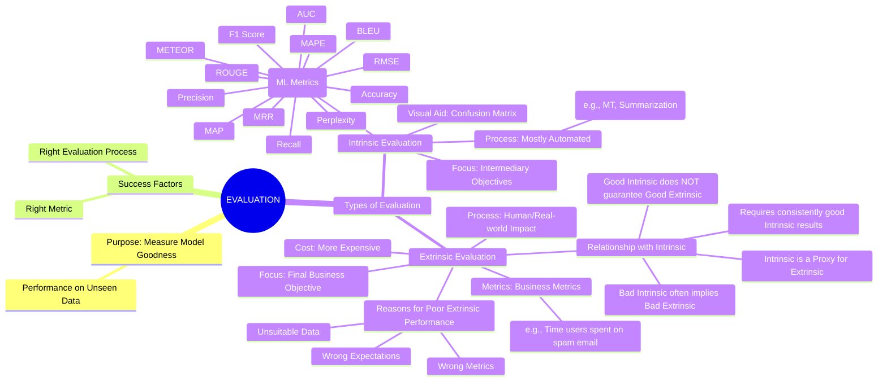

## Introduction

Evaluation is a crucial step in the Natural Language Processing (NLP) pipeline, assessing a model's "goodness," primarily its performance on unseen data. Success hinges on using the right metrics and following a proper evaluation process. Metrics vary by NLP task and pipeline phase (model building, deployment, production), with machine learning (ML) metrics common in early phases and business metrics added in production to gauge business impact.

Evaluations are broadly categorized into two types:
1. Intrinsic Evaluation
2. Extrinsic Evaluation

## Intrinsic Evaluation: 
 - Focuses on intermediary objectives and ML-specific metrics.   
 - Assumes the availability of a test set with "ground truth" labels (human-annotated correct answers), which can be binary, short phrases, or full text.   
 - Model output is compared against these labels, and metrics are calculated based on matches or mismatches.   
 - Can often be automated, but for subjective tasks like machine translation or summarization, full automation is challenging.   

**Common Intrinsic Metrics & Applications:**

| **Metric** | **Description** | **Applications** |
| :--------- | :-------------- | :--------------- |
| **Accuracy** | Fraction of times the model makes correct predictions compared to total predictions. | Classification tasks (e.g., sentiment classification, natural language inference, paraphrase detection). |
| **Precision** | How precise or exact the model’s positive predictions are (given all positive cases, how many are correctly classified). | Classification tasks where false positives are costly (e.g., disease predictions in healthcare). |
| **Recall** | How well the model can recall positive class (given all positive predictions, how many are indeed positive). | Classification tasks where retrieving positive results is more important (e.g., e-commerce search, information-retrieval tasks). |
| **F1 Score** | Combines precision and recall to give a single metric, capturing the trade-off between completeness and exactness. Defined as \(\dfrac{2×Precision×Recall}{Precision+Recall}\). | Most classification tasks, sequence-labeling tasks (e.g., entity extraction, retrieval-based question answering). |
| **AUC (Area Under the Curve)** | Captures the count of correct vs. incorrect positive predictions as the prediction threshold varies. | Measuring model quality independent of the prediction threshold; finding optimal prediction threshold for classification. |
| **MRR (Mean Reciprocal Rank)** | Mean of the reciprocal of the ranks of retrieved results, evaluating responses based on correctness probability. | All information-retrieval tasks (e.g., article search, e-commerce search). |
| **MAP (Mean Average Precision)** | Calculates the mean precision across each retrieved result in ranked retrieval. | Information-retrieval tasks. |
| **RMSE (Root Mean Squared Error)** | Captures a model’s performance in a real-value prediction task; square root of the mean of squared errors. | Regression problems (e.g., temperature prediction, stock market price prediction), often with MAPE. |
| **MAPE (Mean Absolute Percentage Error)** | Average of absolute percentage error for each data point when the output variable is continuous. | Testing regression model performance, often with RMSE. |
| **BLEU (Bilingual Evaluation Understudy)** | Captures n-gram overlap between output and reference sentences. | Machine-translation tasks, adapted to other text-generation tasks (e.g., paraphrase generation, text summarization). |
| **METEOR** | Precision-based metric for text quality, fixing BLEU drawbacks by allowing synonyms and stemmed words to match. | Machine translation. |
| **ROUGE** | Compares quality of generated text to reference text, measuring **recall**. | Summarization tasks (important to evaluate how many words a model can recall). |
| **Perplexity** | Probabilistic measure of how 'confused' an NLP model is, derived from cross-entropy in next word prediction. | Evaluating language models, language-generation tasks (e.g., dialog generation). |
| **Limitations (Automated Text Generation)** | Can be imperfect as multiple correct variations may not be captured in ground truth, leading to false negatives. Often necessitates **human evaluation**, which is expensive. | Machine translation, dialog generation, summarization. |
| **Visual Aids** | **Confusion matrices** inspect actual vs. predicted output for classification. **Recall at rank K** for ranking tasks. | Classification, information retrieval. |
        
## Extrinsic Evaluation:   
- Focuses on evaluating model performance against the **final business objective**.   
- Crucial for industrial projects where AI models aim to solve real-world business problems (e.g., an email ranking model saving user time).   
- A model performing well on intrinsic metrics but failing business objectives is not considered successful.   
- Requires setting up business metrics and measurement processes correctly from the project's start.   
- **Relationship with Intrinsic Evaluation:** Intrinsic evaluation acts as a proxy for extrinsic evaluation, serving as a more cost-effective preliminary step. Only consistently good intrinsic results warrant proceeding to the more expensive extrinsic evaluation, which often involves external stakeholders and end-users.   
- Poor intrinsic results usually imply poor extrinsic results. However, strong intrinsic performance doesn't guarantee extrinsic success, as business failure could stem from incorrect metrics, unsuitable data, or flawed expectations.
        
In summary, evaluating NLP models involves a combination of intrinsic (ML-focused) and extrinsic (business-impact-focused) methods. While intrinsic metrics provide a technical gauge, extrinsic evaluation ultimately determines a model's real-world success and value.

## Resume of the section


