## Abstract

The complexity of modern software systems necessitates a structured design methodology. This article argues against ad-hoc modeling and proposes a sequential, four-phase approach to applying Unified Modeling Language (UML) diagrams. This methodology guides a design from high-level functional requirements (Phase 1) through static structural design (Phase 2), dynamic behavioral modeling (Phase 3), and finally to physical infrastructure (Phase 4). By following this logical progression—from "what" the system must do, to "how" it is built, to "how" it behaves, and "where" it runs—development teams can ensure traceability, reduce ambiguity, and create a robust, maintainable architecture. This article serves as a practical guide for technical students, junior developers, software architects and project managers on which UML diagram to use and when in the design lifecycle.

## I. Introduction

The Unified Modeling Language (UML) is the Object Management Group's (OMG) standard visual language for specifying, visualizing, constructing, and documenting the artifacts of a software-intensive system. It is the _lingua franca_ of software engineering. Without a formal methodology, development teams often create diagrams on an ad-hoc basis, leading to models that are disconnected, contradictory, or incomplete. This results in ambiguous requirements, brittle architectures, and systems that are difficult to maintain. This paper posits that the _order_ in which UML diagrams are created is as critical as the diagrams themselves. A logical, phased approach provides a "story" of the system's design, moving from high-level abstraction to low-level detail. The goal is to provide a sequential, repeatable methodology for students, junior developers, and project managers to tackle a complex design. This paper guides them through four distinct phases, justifying the use of specific UML diagrams at each stage. The paper is structured into four core phases: Phase 1 (Requirements Capture), Phase 2 (Structural Design), Phase 3 (Behavioral Design), and Phase 4 (Implementation and Deployment). A comprehensive example will demonstrate the application of this methodology from start to finish, followed by a concluding summary.
    

## II. Phase 1: Requirements Capture (The 'What')

**Description and Importance:** This initial phase is concerned with establishing the **scope** and **purpose** of the system. It answers the fundamental question, "What is this system supposed to do, and for whom?" All sound architecture is **requirements-driven**. This phase is critical because it forms the "contract" between stakeholders and the technical team. Errors or omissions in this phase are the most expensive to fix later.

**Justification:** We begin here to establish the **system boundary**, its **users (Actors)**, and its **goals (Use Cases)** before any technical or structural decisions are made. This ensures we are building the _right_ system before we worry about building the system _right_.

|**Diagram Name**|**Purpose**|**Elements Extracted (from SRS)**|
|---|---|---|
|**Use Case Diagram**|Models system functionality from the user's perspective. Defines the boundary of the system.|Actors (User Roles), Use Cases (System Functions), System Boundary.|
|**Activity Diagram**|Models the detailed flow of work for a complex business process or Use Case.|Business Processes, Decision Logic (conditions), Sequential Steps, Parallel activities.|

**Suggested Diagram Examples:**

- **Use Case Diagram:** Models the primary interactions for a simple system.
    
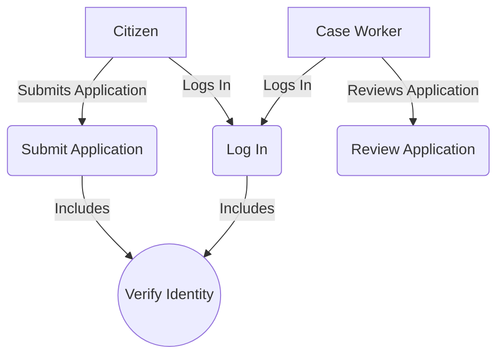

- **Activity Diagram:** Models the detailed workflow of the "Review Application" Use Case.
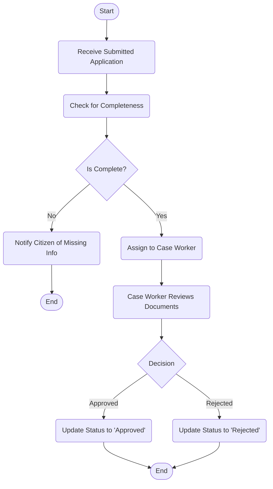

---

## III. Phase 2: Structural Design (The 'Foundation')

**Description and Importance:** With the "what" defined, this phase builds the **static blueprint** of the system. It identifies the primary logical, structural, and conceptual elements—the "nouns" of the system—that will be responsible for carrying out the behavior defined in Phase 1. This is the core logical architecture; a poorly designed structure is brittle and difficult to change.

**Identifying Key System Objects:** The primary classes and components are discovered by analyzing the **nouns** from the Phase 1 artifacts. For example, a "Submit Application" Use Case implies the existence of an `Application` class and a `Citizen` (or `User`) class.

**Suggested Diagram Examples:**

- **Class Diagram:** Models the core classes, their attributes, methods, and relationships.


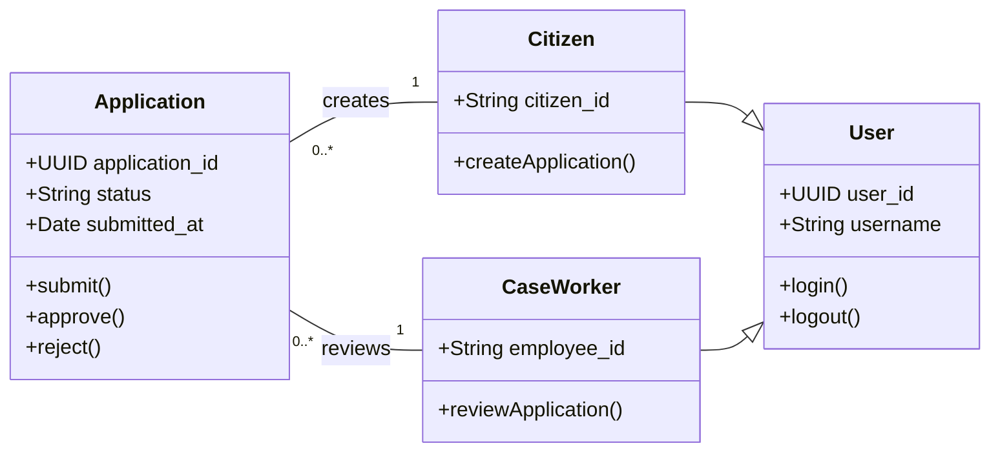

- **Package Diagram:** Organizes the classes into logical, cohesive namespaces to manage complexity.
    

Code snippet

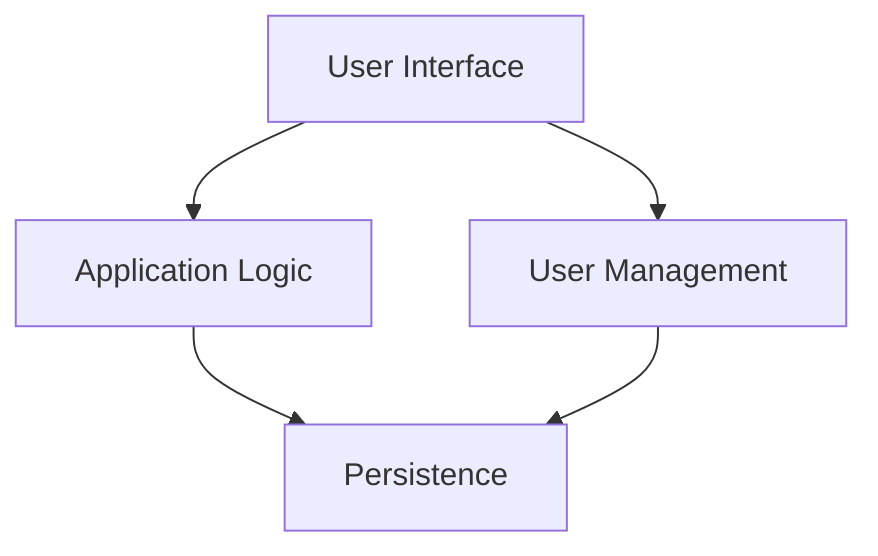

- **Component Diagram:** Shows a higher-level view of the system's replaceable parts and their interfaces.
    

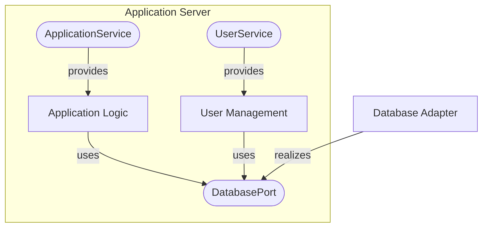

---

## IV. Phase 3: Behavioral Design (The 'How')

**Description and Importance:** This phase **validates** the static structure from Phase 2 by modeling its **dynamic behavior**. It answers the question, "How do these static classes and components _collaborate_ over time to fulfill a Use Case?" Discoveries in this phase often force iterative refinements to the Phase 2 Class Diagram (e.g., discovering a missing method on a class).

**Refining User Flows:** Each Sequence Diagram should model a single, specific scenario of a Use Case (e.g., "Successful Application Submission" or "Failed Application Submission due to Invalid Data"). This granularity is essential for uncovering detailed interaction logic.

**Suggested Diagram Examples:**

- **Sequence Diagram:** Models the time-ordered interaction of objects for one specific scenario.
    

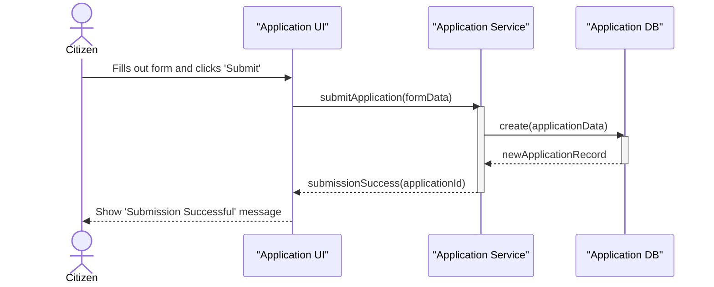

- **State Machine Diagram:** Models the complete lifecycle of a _single_, stateful object, like an `Application`.
    

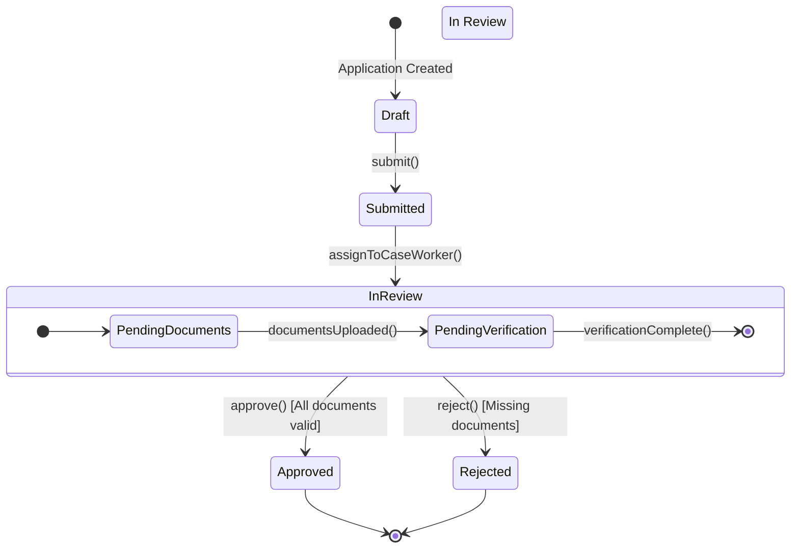

- **Communication Diagram:** (Note: Mermaid does not have a dedicated syntax for UML Communication Diagrams. Their purpose is to show object links and message passing, similar to a Sequence Diagram but focused on spatial relationships, not time. A simple graph can approximate the object links.)
    

---

## V. Phase 4: Implementation and Deployment (The 'Where')

**Description and Importance:** This final phase bridges the gap between the **logical design** (components, classes) and the **physical reality** of the production environment. It answers the question, "Where will the software artifacts run, and how will they be physically distributed?" This is the blueprint for DevOps, System Administrators, and deployment teams.

**Mapping Logical to Physical:** The key activity in this phase is mapping the logical **Components** (from Phase 2) and **Artifacts** (e.g., `.jar`, `.war`, `.exe` files, database schemas) onto the physical **Nodes** (e.g., servers, cloud instances, devices) defined in this diagram.

**Suggested Diagram Examples:**

- **Deployment Diagram:** Models the physical topology of the system's hardware and execution environments.
    
```mermaid
graph TD
    subgraph "Citizen's Device"
        A[Browser]
    end

    subgraph "DMZ"
        B[Load Balancer]
    end

    subgraph "Cloud VPC (Private Subnet)"
        subgraph "Web Server Node (ASG)"
            C[Nginx]
            D[WebApp Artifact (.war)]
            C --> D
        end
        
        subgraph "App Server Node (ASG)"
            E[AppService Artifact (.jar)]
        end

        subgraph "Database Node (RDS)"
            F[PostgreSQL DB]
        end
    end

    A -- "HTTPS" --> B
    B -- "HTTP" --> C
    D -- "API Calls" --> E
    E -- "JDBC" --> F
```

---

## VI. Example: Government Benefit Application System (GBAS)

This section applies the four-phase methodology to a new system: the **Government Benefit Application System (GBAS)**.

**Software Requirements Specification (SRS) Excerpt (ISO/IEC/IEEE 29148:2018 style):**

- **1. Introduction:** This document defines the functional requirements for the GBAS.
    
- **3. Functional Requirements:**
    
    - **FR-3.1 (User Management):**
        
        - **FR-3.1.1:** The system shall allow a **Citizen** to register for an account.
            
        - **FR-3.1.2:** The system shall allow a **Citizen** to log in.
            
    - **FR-3.2 (Application Management):**
        
        - **FR-3.2.1:** The system shall allow a logged-in **Citizen** to create a new benefit **Application**.
            
        - **FR-3.2.2:** The system shall save the **Application** in a **'Draft'** state as the Citizen works on it.
            
        - **FR-3.2.3:** The system shall allow a **Citizen** to submit a completed **'Draft'** Application.
            
        - **FR-3.2.4:** Upon submission, the **Application** state shall transition to **'Submitted'**.
            
    - **FR-3.3 (Case Worker Management):**
        
        - **FR-3.3.1:** The system shall allow a **Case Worker** to log in.
            
        - **FR-3.3.2:** The system shall allow a **Case Worker** to search for and view **'Submitted'** Applications.
            
        - **FR-3.3.3:** The system shall allow a **Case Worker** to transition an Application to **'Approved'** or **'Rejected'**.
            

---

### Phase 1: GBAS Requirements Capture

- **Use Case Diagram:** Based on the SRS, we identify two actors and their primary goals.
    
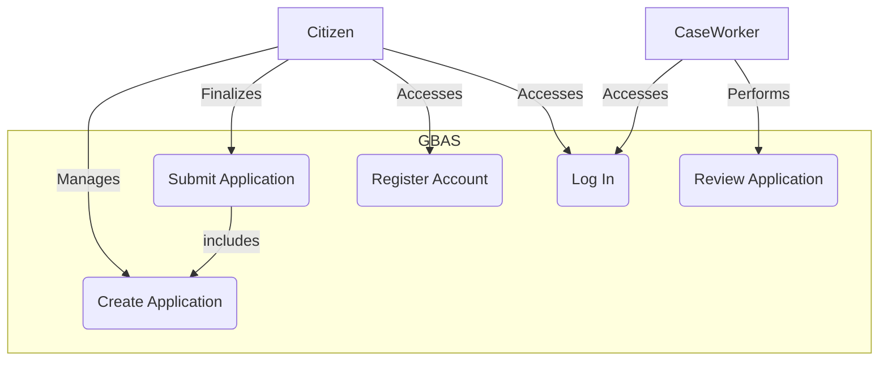

- **Activity Diagram (FR-3.3.2 & FR-3.3.3):** Detailing the "Review Application" workflow.
    

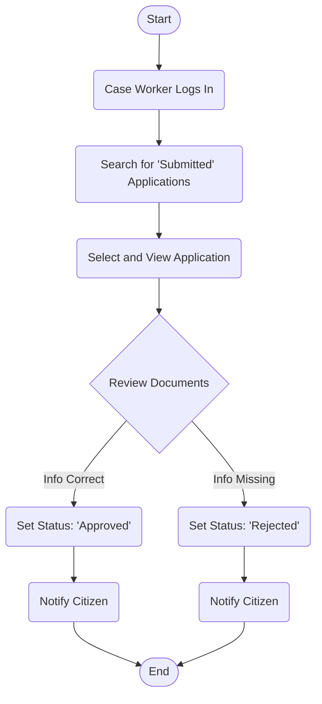

---

### Phase 2: GBAS Structural Design

- **Class Diagram:** From the nouns in the SRS (`Citizen`, `CaseWorker`, `Application`, `Account`).
    
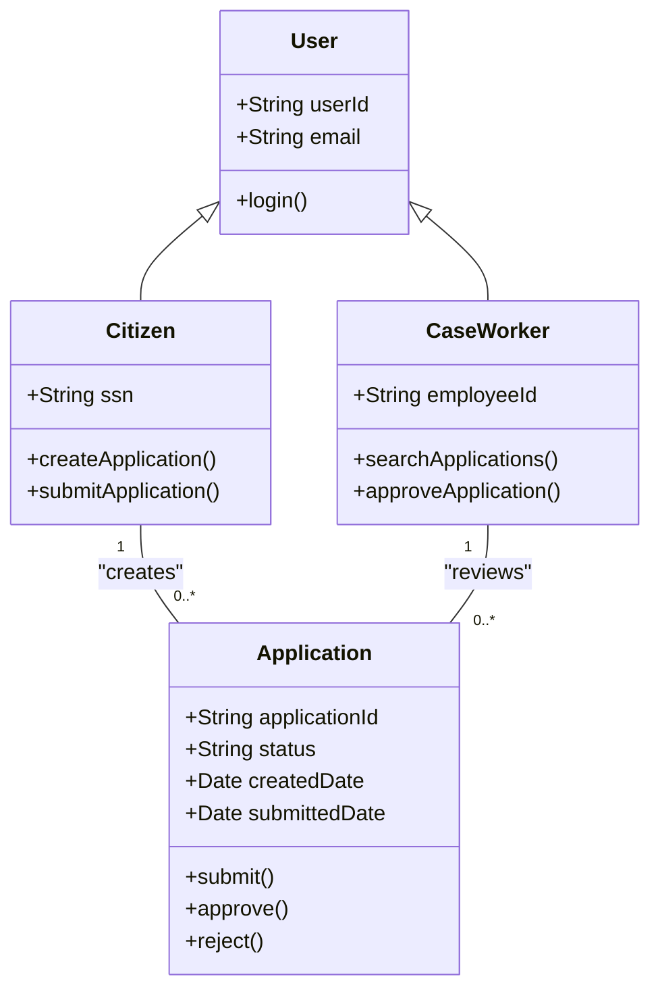

---

### Phase 3: GBAS Behavioral Design

- **Sequence Diagram (FR-3.2.3):** Modeling the "Submit Application" scenario.
    
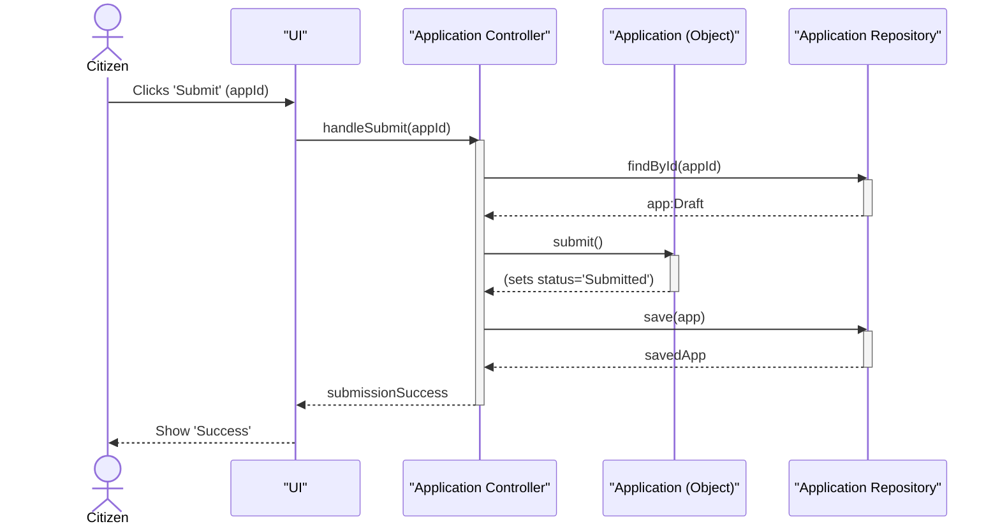

- **State Machine Diagram:** Modeling the `Application` object's lifecycle per the SRS.
    

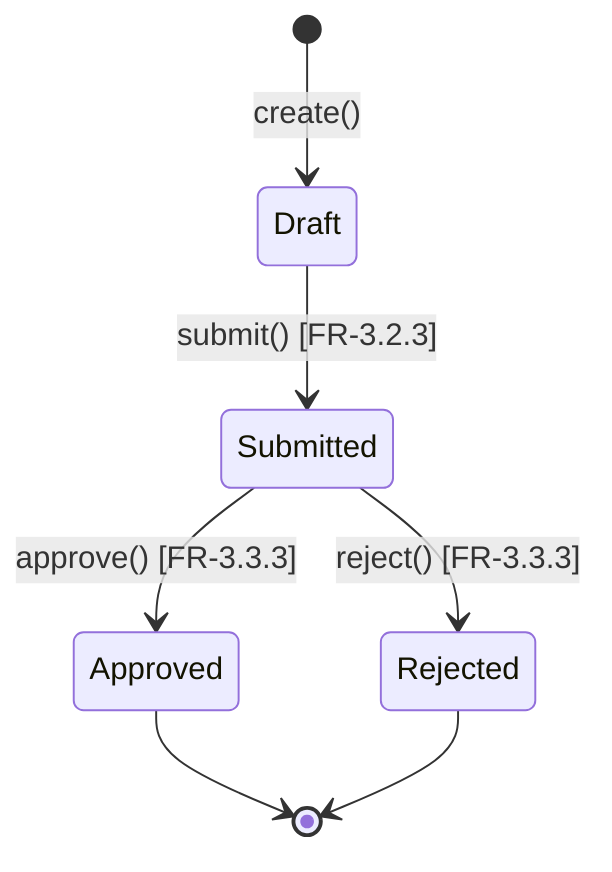

---

### Phase 4: GBAS Implementation and Deployment

- **Deployment Diagram:** Modeling the physical deployment of the GBAS components.
    


```mermaid
graph TD
    subgraph "Citizen's Computer"
        A[Web Browser]
    end

    subgraph "Public Cloud (e.g., AWS/Azure)"
        subgraph "Firewall/WAF"
            B[Load Balancer]
        end
        
        subgraph "Web Server Node (Zone 1)"
            C[WebApp-Artifact.war]
        end

        subgraph "Web Server Node (Zone 2)"
            D[WebApp-Artifact.war]
        end

        subgraph "App Server Node (Zone 1)"
            E[AppService-Artifact.jar]
        end
        
        subgraph "App Server Node (Zone 2)"
            F[AppService-Artifact.jar]
        end

        subgraph "Database Cluster"
            G[Primary DB (Postgres)]
            H[Read Replica DB]
            G -- "Replicates to" --> H
        end
    end

    A -- "HTTPS" --> B
    B -- "routes to" --> C
    B -- "routes to" --> D
    C -- "API Call" --> E
    D -- "API Call" --> F
    E -- "JDBC" --> G
    F -- "JDBC" --> G
```

---

## VII. Conclusion

- **Summary of the Methodology:** This paper has presented a sequential, four-phase approach to system design using UML. By progressing logically from **Requirements (The 'What')** $\to$ **Structure (The 'Foundation')** $\to$ **Behavior (The 'How')** $\to$ **Deployment (The 'Where')**, teams can transform an abstract problem into a concrete, buildable blueprint.
    
- **The Power of Traceability:** This phased methodology creates strong traceability. A physical **Node** (Phase 4) runs a **Component** (Phase 2), which is realized by **Classes** (Phase 2) that collaborate via **Sequence Diagrams** (Phase 3) to fulfill a **Use Case** (Phase 1), which directly maps to a **Functional Requirement** in the SRS. This traceability is essential for validation, testing, and maintenance.
    
- **Sequential Does Not Mean Waterfall:** It is crucial to note that this methodology is **iterative**. A discovery in Phase 3 (e.g., a Sequence Diagram reveals a missing method) _must_ trigger a refinement of the Class Diagram in Phase 2. The sequence provides a logical starting point for each iteration, not a rigid, one-way path.
    
- **Final Remarks:** By adopting this structured methodology, students and professionals alike can master complexity, improve team communication, and ultimately build higher-quality, more robust, and more maintainable software systems.
    

---

## VIII. References

- Object Management Group (OMG). (2017). _OMG Unified Modeling Language (UML) Specification, Version 2.5.1_.
- Booch, G., Rumbaugh, J., & Jacobson, I. (2005). _The Unified Modeling Language User Guide (2nd Edition)_. Addison-Wesley Professional.
- Fowler, M. (2003). _UML Distilled: A Brief Guide to the Standard Object Modeling Language (3rd Edition)_. Addison-Wesley Professional.
- ISO/IEC/IEEE. (2018). _ISO/IEC/IEEE 29148:2018 - Systems and software engineering — Life cycle processes — Requirements engineering_.
- Larman, C. (2004). _Applying UML and Patterns: An Introduction to Object-Oriented Analysis and Design and Iterative Development (3rd Edition)_. Prentice Hall.